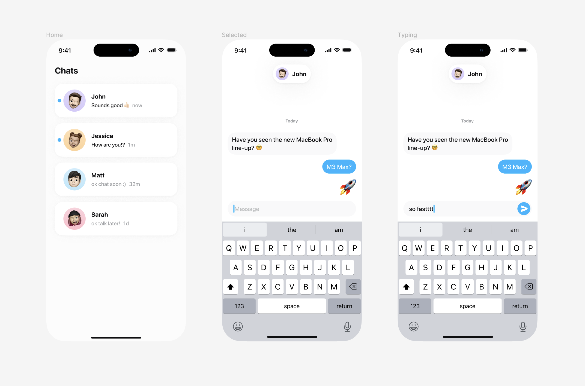

# iOS Challenge

This challenge is part of the iOS hiring process at [Heart
Hands](https://hearthands.tech/).

## Why this challenge?

Heart Hands is operating with a small team of dedicated & talented people. We
are looking for seasoned engineers with a deep technical knowledge, strong
understanding of their technical stack, and excellent product intuitions to join
our team.

This exercise has been designed to give a glimpse of what it is like to build a
messaging app, and the kind of technical challenges we face and care about. We
know time is precious, and we are expecting you to spend no more than 48 hours
on this.

## Summary

You are tasked with the implementation of a messaging app that allows to send
and receive messages with several bots, each in their own chat.

A server is available for you to use. You can read more about it in
[`./server`](./server). Its documentation contains informations on how it can be
run, and what kinds of API endpoints & entities are available.

## Requirements

What are we expecting you to build?

- [ ] The app should start on a screen showing the list of all chats
- [ ] The app should allow opening each chat individually
- [ ] The app should allow sending messages to a chat
- [ ] The app should reflect the messages sent to and received from the server

## Bonus

Some topics to look at if you are looking for ideas to dive deeper:

- [ ] Make the app work offline (both for app state and sending)
- [ ] Make the app resilient to bad network conditions (retries & timeouts)
- [ ] Make the app idempotent in regards to what you send and receive
- [ ] Integrate a splashscreen to hide chats while the app is loading
- [ ] Add support for optimisic sending to give instantaneity in the UI
- [ ] Add support for a local read/unread indicator
- [ ] Avoid block changing states so the app feels fluid & snappy
- [ ] Make the app compatible to run on iPad and macOS
- [ ] Make the app runnable on multiple devices
- [ ] _Anything_ that you feel could improve the UX!

## Design

We have prepared a design to help you during this challenge. You will also
receive the Figma link along with the challenge instructions.

## Challenge Review

We know it's a short amount of time, and you will have to prioritize what you
spend time on. A few things that are important for us and that we will consider
during the review:
- structure: is the code easy to maintain and easy to evolve?
- robustness: is the code tested (or testable, we don't expect 100% code
coverage here)
- documentation: is the readme clear and are important parts of the code documented?

Good luck, and enjoy!
